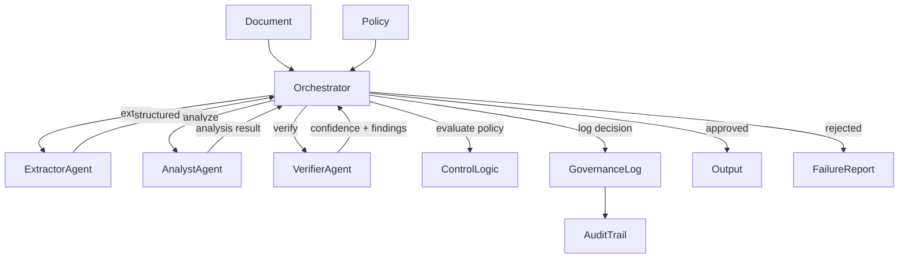

### Failure and Control Model
The orchestrator is the single authority responsible for execution control, policy enforcement, and decision outcomes.

Each stage (extraction, analysis, verification) produces structured outputs that are evaluated against predefined control rules and thresholds.  
If verification criteria or policy constraints are not met, execution is immediately halted and a failure report is generated instead of an output.

This model ensures that AI-driven decisions are **explicitly controlled**, **traceable**, and **defensible**, preventing uncontrolled or non-compliant outcomes in regulated environments.

