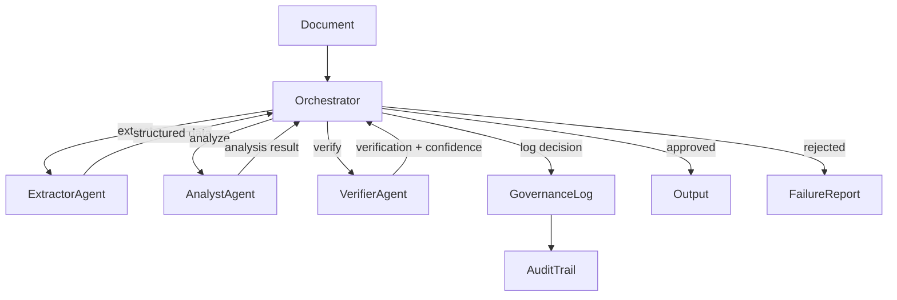

### Failure and Control Model
The orchestrator acts as the single control point of the system.  
If verification thresholds are not met, execution is halted and a failure report is generated instead of an output.

This design prevents uncontrolled AI decisions and ensures that every result can be traced, reviewed, and justified.
